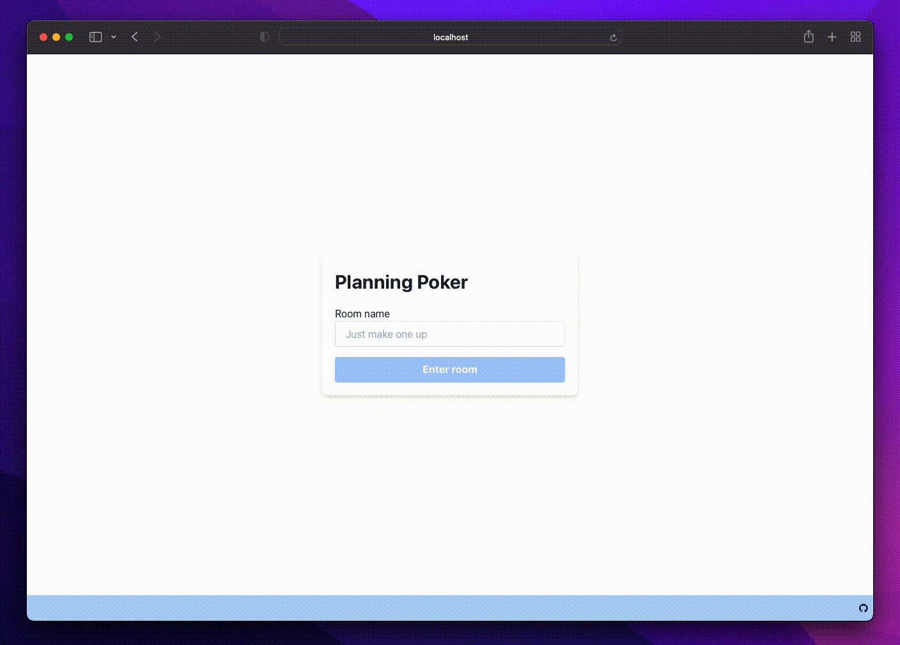

# planning-poker

Planning poker is a minimalistic "no-rule", "no-setup" [scrum poker](https://en.wikipedia.org/wiki/Planning_poker) web tool.

## How to use it

1. Visit the website [pl-poker.io](https://pl-poker.io/)
2. Enter the room name. You don't have to make a room, just use the same name as your collegues
3. Enter your own name
4. Select a card and flip it when your team is ready

> You can also go straiaght into the room if your colleagues share a link with you [https://pl-poker.io/r/my%20team](https://pl-poker.io/r/my%20team)

## No-Rule No-Setup

[Planning poker](https://en.wikipedia.org/wiki/Planning_poker) also known as as "Scrum poker" is a common technique used by Agile teams to estimate on planned work. Planning poker is a very well defined and structured "game". However, there is a vast difference in between how different teams implement it. When played in real life with real cards, this process is simple as rules are known by the team and players have control on when to flip, place or take back cards.

### No-rule

Upon using a few online scrum poker tools it was noticible that most of the tooling avaliable has strict rules such as: "All participants must place a card down", or "Cards are only flipped when all cards are down". This implementation of planning poker removes any rules, and lets players do anything they like. If they need to sit out a estimation round for any reason they can simply not place a card down. If someone decides to flip their card early they can do so, this is simply a tool like a deck of cards and forces no rules and has no restrictions.

### No-setup

This implementation of planning poker also removes setups. Entering a room is as simple as just following the link. No need to "Create" and "Join" a room. You simply "Enter a room" and you "Leave the room" when you close your tab.
